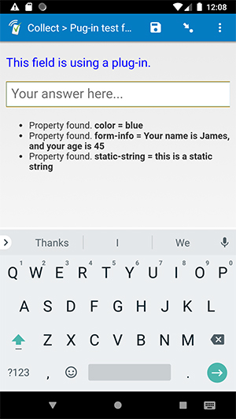

# example-parameters

## Description

This field plug-in is meant to demonstrate how to access and use parameters with your field plug-ins. A list of the current parameters will be shown below the text input field. If one of the parameters is "color", this plug-in will change the color of the field label to that value.

*Note: this is not intended to be used to collect actual data. It is intended for demonstration/testing purposes.*

## How to use

1. Download the test form [extras/test-form](extras/test-form) from this repo and upload it to your SurveyCTO server.
1. Download the [example-parameters.fieldplugin.zip](example-parameters.fieldplugin.zip) file from this repo, and attach it to the test form on your SurveyCTO server.

## More resources

* **Developer documentation**  
More instructions for developing and using field plug-ins can be found here: [https://github.com/surveycto/Field-plug-in-resources](https://github.com/surveycto/Field-plug-in-resources)
